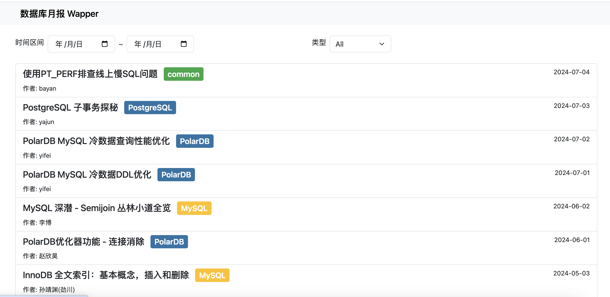

# 数据库内核月报 Wrapper

## 简介

本项目是[阿里的数据库内核月报](http://mysql.taobao.org/monthly)网站的封装服务，以便于可以根据时间或数据库类型过滤查看文章。

## 部署

> 首次启动如果数据库中没有数据会全量抓取文件链接，所以需要等待一段时间后，页面才可以看到数据，后续启动增量爬取

```shell
cp src/config.ini.sample src/config.ini
vim src/config.ini # 修改配置

pipenv install --python `python3 -c "import platform;print(platform.python_version())"`
pipenv run python src/main.py
```

## 预览

- [https://alidbmonthly.vimiix.com](https://alidbmonthly.vimiix.com)



## 说明

- 服务启动后每天 0 点探测是否有新的文章，有的话增量更新；
- 本项目不存储文章的内容，仅管理文章的链接，阅读文章仍是跳转到原网站；
- 感谢阿里团队持续输出的数据库干货文章
